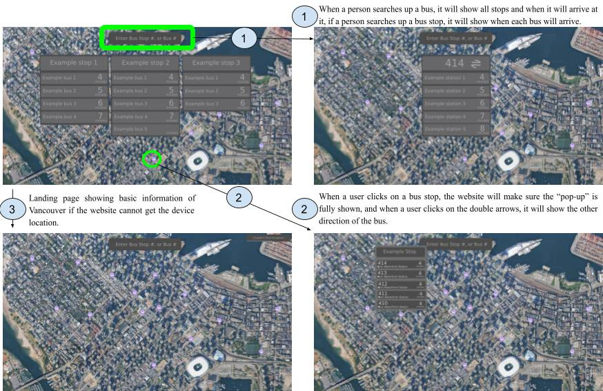
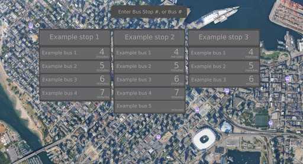
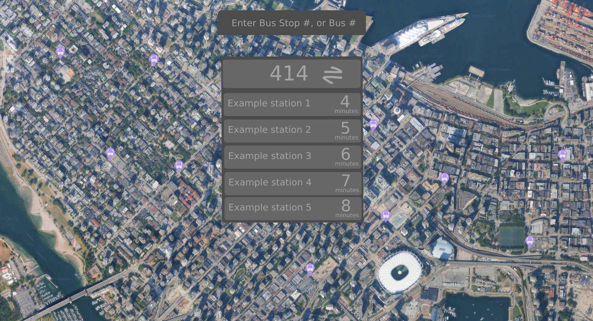
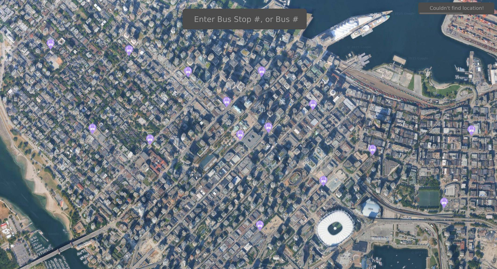
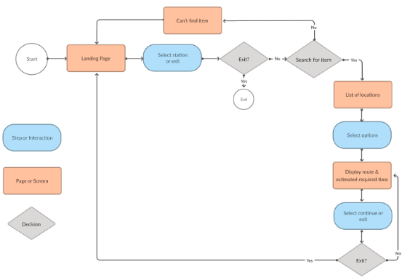

# Vancouver Transit Tracker
Project Propsal Report
[link to pdf version](Project%20proposal%20report.pdf)

## Overview of the project and the problem it aims to solve
Our Translink bus tracker helps Vancouver residents easily figure out bus schedules, unlike Google Maps, which will only give results for entire trip calculations. Our website gives you the raw information. The main issue we hope to solve is that most residents already know what buses they want to catch, and most of us know of alternative routes to reach the same destination; the only problem is that Google Maps does not account for that. By giving the raw information on exactly what time a bus will arrive, it allows the user to make the best decision, instead of relying on some algorithm Google designed.

## Explanation of where the idea came from and why it is important
The idea came from our frustration with Google Maps sometimes giving incorrect information about transit trips. We have all experienced Google Maps giving long bus routes because the algorithm had decided we could not walk 100m in 5 minutes to catch the earlier bus. Our website fixes this by just giving you the information you want to see. If our website tells you that a bus is coming in 4 minutes, you can make your own decisions based on that, whereas alternatives like Google Maps will factor in walking distance into scheduling. 

## List of potential users and their needs (how this application fulfills those needs)
Younger Vancouver Residents
- Our website uses the translink api, so we are mostly only targeting Vancouver residents. Because our website only tracks schedules, this is beneficial to the members of the public who are open to the idea of running to catch the earlier bus, whereas alternative apps such as Google Maps will not show routes for buses in which a person needs to run to catch.

People without access to Google services
- Our website relies on Translink information and static Google Maps data, which makes our website ideal for people with phones that cannot use Google services. We provide a somewhat alternative to trip planning as we notify the user where the bus is going and when it will arrive at each stop.

## 1 Persona for each application user group
- Michael is a student in Vancouver who relies on transit to get anywhere from his part-time work to his school. Michael knows of multiple routes he can take to get to his desired locations, and he also knows that Google Maps can hide faster routes based on longer walking distances, which Michael is fine with. Michael uses our website to get bus schedules and real-time updates because he knows that Google Maps will hide bus routes that require him to run to catch.
- Bob is a tourist who is unfamiliar with Vancouver, and comes from a country that does not have access to Google services. He just wants a simple way to access transit information to see when the next bus is coming. Bob uses our website to get transit information, as it does not require Google services and can give schedules for bus stops near him.

## List chosen APIs (4 total) and a brief description of each
Notifications API ([link](https://developer.mozilla.org/en-US/docs/Web/API/Notifications_API)) (Primary)
- API used for allowing user notifications through web applications such as Chrome for mobiles and computers.

Translink API ([link](https://www.translink.ca/about-us/doing-business-with-translink/app-developer-resources)) (Primary)
- API used to get all information about incoming buses, bus schedules and bus stops. The main website will be built around information received from this API.

Citybikes API ([link](https://api.citybik.es/v2/)) (Backup)
- API used to get location and information on alternative modes of transportation (bikes, e-bikes, scooters). This API will also be used to receive information on charging stations (location and stock).

Groq Chatbot API ([link](https://groq.com/)) (Backup)
- API used for user assistance, such as the user manual, information from other listed APIs

## A brief description of the features we plan to implement for each API (3 features per API, 12 features total)
Notifications API (Primary)
- Send a notification when the bus is late/early
- Send notification for urgent alerts (skytrain technical issues, bus issues, other issues sent from the Translink API)
- Send a notification when the bus schedule changes

Translink API (Primary)
- Get the schedule for the specified bus (gets the times that the bus will arrive at each station)
- Get the next bus for the specified bus stop (gets the next bus and time for every bus that will arrive at the specified bus stop)
- Get urgent alerts (get alerts for technical issues, which can be passed to the notification API)

Citybikes API (Backup)
- Get nearest charging station (returns location and stock for the nearest charging station to be mapped out)
- Get the nearest alternative mode of transportation (returns location of nearest scooters, bikes, and ebikes)
- Get an alternative mode of transportation company and information (returns information about the company that owns the scooter or e-bike, and gets a website link that makes it easier for customers to rent)

Groq Chatbot API (Backup)
- Asking AI when the next bus is (returns the next bus at the nearest bus stop)
- Asking AI when the  bus will arrive (returns information on the requested bus)
- Asking AI about bus stops (returns information on either the requested bus stop, or if not specified, all bus stops nearby)

## 1 User story for each feature you plan to implement
Translink API
- As someone on the go, I want to view the schedule for a specific bus, so that I can plan to catch it at each station.
- As a student, I want to view a specific bus stop, so that I can know how long I need to wait for the next bus.
- As a frequent transit user, I want to receive urgent alerts regarding transit, so that I am always aware of potential delays or the need to reroute.

Notifications API
- As a commuter, I want to receive a notification when the bus is running early or late, so that I can adjust my plans accordingly.
- As a transit user, I want to receive urgent alerts regarding service disruptions so that I can take alternative routes if necessary.
- As a traveler, I want to receive a notification if my bus schedule has changed, so that I am always aware of my current schedule.

Citybikes API
- As a frequent city bike user, I want to know where the nearest charging station is, so that I can quickly locate a charging station and charge my e-bike
- As someone who likes to get around quickly, I want to know the nearest alternative mode of transportation, so that I can be prepared if my original route changes unexpectedly.
- As a supporter of green commuting, I want to be able to quickly access the transportation company's website and information, so that I can learn more about the company and quickly rent an e-bike.

Chatbot API (Groq)
- As a busy commuter, I want to quickly ask AI for information on the next bus so that I can save time trying to find information manually.
- As someone who frequently runs late, I want to know when the bus I'm currently on will arrive at its destination, so I can determine if I need to run the rest of the way to where I need to go.
- As someone unfamiliar with the area, I would like to ask AI which bus stops are nearby or get details regarding a specific bus stop, so I can quickly figure out where to go.

## A low-fidelity storyboard of the application interface/features
*Colors in pictures are not final.*

 The default landing page will show all nearby bus stops and when the next bus will arrive at them.

 When a user clicks on a bus stop, the website will make sure the “pop-up” is fully shown, and when a user clicks on the double arrows, it will show the other direction of the bus.

 Landing page showing basic information of Vancouver if the website cannot get the device location.

## User flow and how the user will interact with the application

## Front-end technology stack that this project will be based on
UI framework
- Tailwind CSS
- React.js

Testing Framework
- Cypress
- CI/CD pipeline 

Github Actions
- Web hosting platforms
- Render or Vercal

## Explanation of chosen stack technology
As a team, we chose to use Tailwind CSS and React.js for our UI framework. We chose these mostly due to the fact that they were the most used and most documented. We try to keep things simple, our website isn’t going to be groundbreaking by any standard, so we chose to keep things as straightforward as possible, and React.js is by far the most popular frontend framework. We also chose to pair Tailwind CSS with React, to speed up our front-end development. As our website is mostly frontend-focused, and we will have almost no backend, we chose to use Cypress as our testing framework, as Cypress is focused on front-end testing, and excels in end-to-end tests, which is more important to us. Our CI/CD pipeline consists of GitHub Actions. For us, GitHub Actions was a no-brainer, especially since we plan on initially hosting our website on GitHub, and GitHub Actions is built into GitHub, simplifying our process. We are still unsure about our web hosting platform, as we don’t fully plan on adding ads to our website and currently, with our translink API key, we are limited to 1000 requests per day, so having a public website would not be feasible. However that being said, Render and Vercel are very compelling as they do offer free hosting.